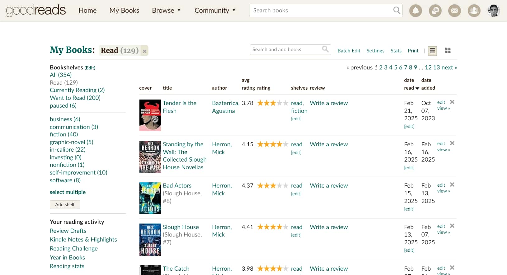
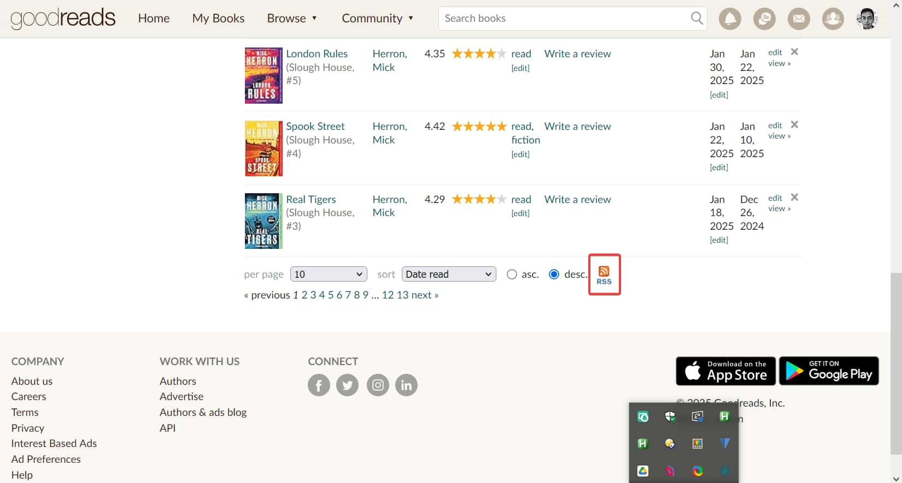

# `astro-loader-goodreads`

[![npm version][npm-version-src]][npm-version-href]
[![npm downloads][npm-downloads-src]][npm-downloads-href]
[![License][license-src]][license-href]
[![JSDocs][jsdocs-src]][jsdocs-href]
[![bundle][bundle-src]][bundle-href]

[![Astro][astro-src]][astro-href]
[![Goodreads][goodreads-src]][goodreads-href]
[![How to use Goodreads data in Astro ][how-to-use-src]][how-to-use-href]

**Load data for books in Goodreads shelves/lists into Astro.**

> [!NOTE]
> `astro-loader-goodreads` uses the [Astro Content Loader API](https://docs.astro.build/en/reference/content-loader-reference/) to fetch data from Goodreads shelf RSS feeds.
>
> See the [Usage](#usage) section below for instructions on how to use the package to load the fetched Goodreads data into [Astro Content Collections](https://docs.astro.build/en/guides/content-collections).

> [!IMPORTANT]
> **The RSS feed for a Goodreads shelf only includes the last 100 books added to that shelf.** This means that if there are more than 100 books in a shelf, `astro-loader-goodreads` will not be able to retrieve them all.
>
> You can, however, create multiple shelves (e.g. _read-2025_, _read-2026_, etc.) and then create a content collection for each shelf to get around this limitation.

## Installation

```sh
npm add astro-loader-goodreads
```

## Usage

In your `src/content.config.ts` or `src/content/config.ts` file, define your collections with the `goodreadsLoader` function.

```ts
import { defineCollection } from "astro:content";
import { goodreadsLoader } from "astro-loader-goodreads";

const books = defineCollection({
  loader: goodreadsLoader({
    GOODREADS_SHELF_URL: "https://<goodreads-shelf-rss-feed-url>",
  }),
});

export const collections = { books };
```

You can then use the defined Goodreads content collection in your Astro pages and components:

```astro
---
import { getCollection } from "astro:content";

const books = await getCollection("books");
---

<ul>
  {books.map((book) => (
    <li>
      <h2>
        <a href={book.data.link}>
          {book.data.title}
        </a>
      </h2>
      
      <p> Author: {book.data.author_name} </p>
      <p> Rating: {book.data.user_rating} </p>
      <p> Published: {book.data.pubDate} </p>
      <p> Added to shelf: {book.data.user_date_added} </p>
      <p> Description: {book.data.book_description} </p>
      <!-- more fields... -->
    </li>
  ))}
</ul>
```

> [!NOTE]
> For the full list of fields available for Astro content collections created using `astro-loader-goodreads`, see the [Data Schema](#data-schema) section below.

## Loader Options

| Property              | Description                               | Required   |
| --------------------- | ----------------------------------------- | ---------- |
| `GOODREADS_SHELF_URL` | The URL of your Goodreads shelf RSS feed. | _required_ |

## How to Get Your Goodreads Shelf RSS Feed URL

### If you have the Goodreads shelf URL

Append `_rss` to the `list` text in the Goodreads shelf URL to get the RSS feed for that shelf:

```diff
-https://www.goodreads.com/review/list/152185079-sadman-hossain?shelf=read
+https://www.goodreads.com/review/list_rss/152185079-sadman-hossain?shelf=read
```

For more details on how Goodreads shelf RSS feeds work, see [How to use Goodreads data in Astro](https://sadman.ca/posts/how-to-use-goodreads-data-in-astro/#goodreads-rss-feeds).

### If you don't have the Goodreads shelf URL

1. Go to your Goodreads account.
2. Navigate to the shelf you want the RSS feed for.
3. Find the RSS feed button at the bottom of the page.
4. Right-click and copy the URL.




## Examples

Below are some examples of websites that use `astro-loader-goodreads`. If you wish to add your site to this list, open a pull request!

| Site                           | Page                                       | Description                                             | Source                                  |
| ------------------------------ | ------------------------------------------ | ------------------------------------------------------- | --------------------------------------- |
| [sadman.ca](https://sadman.ca) | [sadman.ca/about](https://sadman.ca/about) | Books I'm currently reading and have recently finished. | [↗](https://github.com/sadmanca/blogv2) |

## Data Schema

Validating the schema is optional, but recommended when defining content collections with data loaded using `astro-loader-goodreads`. The schema is used to validate the data returned from the API.

Below is the current schema of data fields loaded by `astro-loader-goodreads` (field names match those in the Goodreads RSS feed):

```ts
import { defineCollection, z } from "astro:content";
import { goodreadsLoader } from "astro-loader-goodreads";

const books = defineCollection({
  loader: goodreadsLoader({
    GOODREADS_SHELF_URL: "https://<goodreads-shelf-rss-feed-url>",
  }),
  schema: z.object({
    id: z.coerce.string(),
    title: z.coerce.string(),
    guid: z.string(),
    pubDate: z.string(),
    link: z.string(),
    book_id: z.coerce.string(),
    book_image_url: z.string(),
    book_small_image_url: z.string(),
    book_medium_image_url: z.string(),
    book_large_image_url: z.string(),
    book_description: z.string(),
    num_pages: z.string().optional(),
    author_name: z.string(),
    isbn: z.coerce.string(),
    user_name: z.string(),
    user_rating: z.number(),
    user_read_at: z.string(),
    user_date_added: z.string(),
    user_date_created: z.string(),
    user_shelves: z.string().optional(),
    user_review: z.string().optional(),
    average_rating: z.number(),
    book_published: z.coerce.string(),
  }),
});

export const collections = { books };
```

### Data Field Descriptions

| Field                   | Description                                                                         |
| ----------------------- | ----------------------------------------------------------------------------------- |
| `id`                    | Unique identifier for book                                                          |
| `title`                 | Title of book                                                                       |
| `guid`                  | Globally unique identifier for book entry                                           |
| `pubDate`               | Publication date of book entry                                                      |
| `link`                  | URL link to book's Goodreads page                                                   |
| `book_id`               | Unique identifier for book on Goodreads                                             |
| `book_image_url`        | URL of book's cover image (typically the same resolution as `book_small_image_url`) |
| `book_small_image_url`  | URL of book's small cover image (50×75 px)                                          |
| `book_medium_image_url` | URL of book's medium cover image (65×98 px)                                         |
| `book_large_image_url`  | URL of book's large cover image (316×475 px)                                        |
| `book_description`      | Description of book                                                                 |
| `num_pages`             | Number of pages in book (optional)                                                  |
| `author_name`           | Name of book's author                                                               |
| `isbn`                  | International Standard Book Number (ISBN) of book                                   |
| `user_name`             | Name of user who added book to their Goodreads shelf                                |
| `user_rating`           | Rating given to book by user                                                        |
| `user_read_at`          | Date when user finished reading book                                                |
| `user_date_added`       | Date when book was added to user's Goodreads shelf                                  |
| `user_date_created`     | Date when book entry was created on Goodreads                                       |
| `user_shelves`          | Shelves/categories user has assigned to book (optional)                             |
| `user_review`           | Review written by user for book (optional)                                          |
| `average_rating`        | Average rating of book on Goodreads                                                 |
| `book_published`        | Publication date of book                                                            |

## License

`astro-loader-goodreads` is [MIT licensed](https://github.com/sadmanca/astro-loader-goodreads/blob/main/LICENSE).

[npm-version-src]: https://img.shields.io/npm/v/astro-loader-goodreads?style=flat&logo=npm&colorA=ea2039&colorB=2e2e2e
[npm-version-href]: https://npmjs.com/package/astro-loader-goodreads
[npm-downloads-src]: https://img.shields.io/npm/dm/astro-loader-goodreads?style=flat&logo=npm&colorA=ea2039&colorB=2e2e2e
[npm-downloads-href]: https://npmjs.com/package/astro-loader-goodreads
[license-src]: https://img.shields.io/badge/license-MIT-080f12?style=flat&colorA=2e2e2e&colorB=blue
[license-href]: https://github.com/sadmanca/astro-loader-goodreads/blob/main/LICENSE
[jsdocs-src]: https://img.shields.io/badge/jsdocs-astro--loader--goodreads-080f12?style=flat&colorA=2e2e2e&colorB=525252
[jsdocs-href]: https://www.jsdocs.io/package/astro-loader-goodreads
[bundle-src]: https://img.shields.io/bundlephobia/minzip/astro-loader-goodreads?style=flat&colorA=2e2e2e&colorB=1f8f00
[bundle-href]: https://bundlephobia.com/result?p=astro-loader-goodreads

[astro-src]: https://img.shields.io/badge/Astro-0690FA?style=flat&logo=astro&logoColor=ffffff&color=5e15a1
[astro-href]: https://astro.build
[goodreads-src]: https://img.shields.io/badge/Goodreads-0690FA?style=flat&logo=goodreads&logoColor=7e470f&color=e9e4d0
[goodreads-href]: https://goodreads.com
[how-to-use-src]: https://img.shields.io/badge/How_to_use_Goodreads_data_in_Astro-0690FA?style=flat&logo=amp&logoColor=6854ff&color=2e2e2e
[how-to-use-href]: https://sadman.ca/posts/how-to-use-goodreads-data-in-astro/
